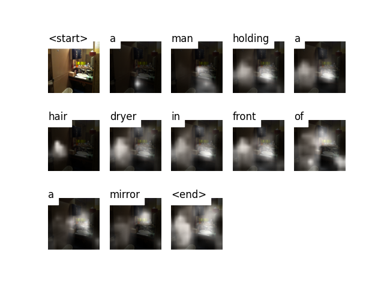

# CamEye

**To build a model that can generate a descriptive caption for an image we provide it.**

[_Show, Attend, and Tell_](https://arxiv.org/abs/1502.03044) paper

This model learns _where_ to look. As you generate a caption, word by word, you can see the model's gaze shifting across the image. This is possible because of its _Attention_ mechanism, which allows it to focus on the part of the image most relevant to the word it is going to utter next.

---

# Concepts

* **Image captioning**

* **Encoder-Decoder architecture**. Typically, a model that generates sequences will use an Encoder to encode the input into a fixed form and a Decoder to decode it, word by word, into a sequence.

* **Attention**. The use of Attention networks is widespread in deep learning, and with good reason. This is a way for a model to choose only those parts of the encoding that it thinks is relevant to the task at hand. The same mechanism you see employed here can be used in any model where the Encoder's output has multiple points in space or time. In image captioning, you consider some pixels more important than others. In sequence to sequence tasks like machine translation, you consider some words more important than others.

* **Transfer Learning**. This is when you borrow from an existing model by using parts of it in a new model. This is almost always better than training a new model from scratch (i.e., knowing nothing). As you will see, you can always fine-tune this second-hand knowledge to the specific task at hand. Using pretrained word embeddings is a dumb but valid example. For our image captioning problem, we will use a pretrained Encoder, and then fine-tune it as needed.

* **Beam Search**. This is where you don't let your Decoder be lazy and simply choose the words with the _best_ score at each decode-step. Beam Search is useful for any language modeling problem because it finds the most optimal sequence.

Thanks
